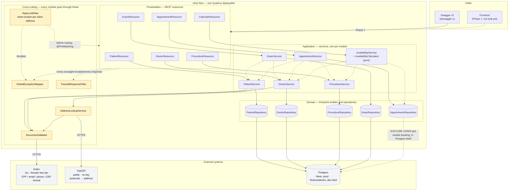

# clinic-flow

A clinic management system — patients, doctors, procedures, exams,
appointments, billing and calendar, one place — built to run a **public
demo**: two seeded accounts, `admin`/`admin123` and `doctor`/`doctor123`, log
in and try the real flow, not a screenshot of it. Reading is open to anyone;
writing needs one of those two logins — see [Authentication](#authentication)
for why that is a deliberate change from this project's earlier "anyone can
write anonymously" shape, not an accident.

Java 25, Quarkus 3.39. Backend for a portfolio project; the frontend (GSAP,
animejs, PT/EN/ES) is a separate app consuming this API.

## Status

**Rate limiting and real authentication.** Everything through the calendar
(patients, doctors, procedures, exams, appointments, double-booking rejected
by Postgres itself, availability) plus two things every public API needs
before it should actually be public: every client address is throttled by a
token bucket, and every write now requires a JWT obtained by logging in as
one of two seeded demo accounts — see
[Rate limiting](#rate-limiting) and [Authentication](#authentication).

## Architecture

One deployable, not a service mesh — see
[ADR-0001](docs/adr/0001-modulith-not-microservices.md) for why, given this
has to run on a Render free instance for a demo nobody scheduled in advance.
Modules are packages with real boundaries (`patient`, and whichever of the
roadmap below lands next), not layers spanning the whole domain.

Document validation — CPF, email, phone, postcode format — is not
reimplemented here. `clinic-flow` calls the already-deployed `brdoc` service
over HTTP; see [ADR-0002](docs/adr/0002-brdoc-over-http-not-reimplemented.md).
Postcode *content* (street, city, state) comes from ViaCEP, Brazil's public
postcode lookup, and is never allowed to block registration if it is slow or
down — see `AddressLookupService`.

Rendered as a diagram rather than described in prose, because the shape —
one REST layer, one service layer per module, one place every module reaches
the outside world through — is the point ADR-0001 and ADR-0002 argue for.
[Mermaid](https://mermaid.js.org/) renders this natively wherever this file
is viewed on GitHub — no draw.io account, no exported image to keep in sync
by hand, no dead link when the diagram changes; the diagram *is* the text
below it.



Solid arrows are calls made on every request through that path; dashed
arrows are either a module reusing another module's *service* (never its
entity or repository directly — that boundary is what keeps this a modulith
and not a shared-table free-for-all) or a guarantee that lives in Postgres
itself rather than in a call at all.

```
patient/             entity, repository, service, REST resource, DTOs
doctor/               same shape as patient/, plus a licence number
procedure/            the bookable catalogue — no brdoc involvement, no documents
exam/                 requested against a patient by a doctor, result recorded later
appointment/          patient + doctor + procedure + time slot; the double-booking
                      guarantee lives in the database, not here — see V5's migration
calendar/             the query side of scheduling — AvailabilityCalculator is pure,
                      unit-tested logic; AvailabilityService is where it meets the
                      database and the working-hours config
address/              the embeddable Address value object + the ViaCEP lookup
validation/brdoc/     the brdoc REST client and the DocumentValidator every
                      module validates through
validation/viacep/    the ViaCEP REST client
common/               the one exception mapper every module's errors go through,
                      the CPF-masking helper, and the trace-id response filter
ratelimit/            token-bucket rate limiting and the client-address resolver
                      GlobalExceptionMapper's logging also goes through
auth/                 login, JWT issuance, the two seeded demo accounts
```

## Concurrency and observability

Every resource method runs `@RunOnVirtualThread`: the code is ordinary
blocking Java — JPA, a blocking REST client call to brdoc — and a virtual
thread is what lets that scale like non-blocking code without becoming
non-blocking code. No manual thread-pool tuning, no reactive rewrite of
Hibernate ORM into Hibernate Reactive, no `Uni`/`Multi` chains threaded
through every method signature — the throughput case a reactive stack exists
to make is already made, at a fraction of the complexity.

Every request generates an OpenTelemetry trace id, which reaches every log
line that request produces (`quarkus.log.console.format` in
application.properties) and comes back to the caller as `X-Trace-Id`
(`TraceIdResponseFilter`). One identifier ties a request, its response and
every log line it wrote together — a caller reporting a problem can hand back
that one value. No collector is deployed yet (`quarkus.otel.traces.exporter=none`),
so nothing is exported anywhere; the ids exist and reach the logs regardless.

### Error handling

Every error this API returns — however it happened — comes back through
`GlobalExceptionMapper`, in one shape:

```json
{
  "field": "cpf",
  "message": "Invalid CPF format",
  "category": "VALIDATION",
  "traceId": "9be69c71af1b5854bdb8139bae338f26",
  "timestamp": "2026-09-04T18:51:37.303203Z",
  "path": "/v1/patients"
}
```

`category` is what makes the logs answerable at a glance — the question
"is this a bug, or someone sent bad data" without reading a stack trace:

| Category | Means | Example |
|---|---|---|
| `VALIDATION` | Well-formed request, a value fails a rule brdoc or this API owns | An invalid CPF |
| `CONFLICT` | Valid on its own, conflicts with state that already exists | A duplicate CPF, a double-booked doctor |
| `NOT_FOUND` | A referenced id does not exist | An unknown patient id |
| `SYSTEM` | Unexpected — everything else | brdoc timed out |

Every rejection is also logged at the point `GlobalExceptionMapper` decides
it — status, exception type, the caller's address, and the path — tagged
with the same trace id as the response, via `quarkus.log.console.format`.
A `SYSTEM` error additionally logs the full exception. Never logged, in any
category: the value that was rejected — a CPF is still personal data even
when invalid, and this service is reachable from a public sandbox.

### Rate limiting

A token bucket per client address (`ratelimit/`), same shape as brdoc's own:
in memory, not Redis — the work being protected (a JPA insert, a call to
brdoc) is already cheaper than a network round trip would be to guard it.
Default 20 requests/second, burst of 60, both overridable
(`clinic.rate-limit.requests-per-second`, `...burst`). `/q/health` is exempt,
so a monitor never reports an outage that is not happening. A throttled
request gets a 429 in the same `ApiError` shape as everything else
(`category: RATE_LIMITED`) with `Retry-After: 1`.

"Client address" means the same thing here as in the error log above —
resolved once, by `ClientAddressResolver`, and shared by both. `TRUSTED_PLATFORM=cloudflare`
(hardcoded in `%prod`, since it is a fact about Render, not a secret) reads
`CF-Connecting-IP`, which Cloudflare sets on every request and a direct
caller cannot forge; unset, the connection's own remote address is used,
which collapses everyone behind one proxy into a single bucket but is never
spoofable. This is the same principled approach as brdoc's own
`TRUSTED_PLATFORM`, deliberately — including the env var's name.

### Authentication

Two roles, matching the two kinds of work this clinic actually has —
`ADMIN` (registers patients and doctors, maintains the procedure catalogue)
and `DOCTOR` (schedules and cancels appointments, requests and records
exams) — not a general-purpose permission system built ahead of a role a
third kind of user would need. Every `GET` stays open to anyone; every
`POST` needs a valid JWT with the right role.

```bash
curl -X POST https://clinic-flow.onrender.com/v1/auth/login \
  -H "Content-Type: application/json" \
  -d '{"username": "admin", "password": "admin123"}'
# {"token": "eyJ...", "expiresInSeconds": 28800, "role": "ADMIN"}

curl -X POST https://clinic-flow.onrender.com/v1/procedures \
  -H "Authorization: Bearer eyJ..." -H "Content-Type: application/json" \
  -d '{"name": "Consultation", "durationMinutes": 30, "priceCents": 15000}'
```

Two seeded accounts (`admin`/`admin123`, `doctor`/`doctor123`, V6's
migration) exist so a public demo login is possible from the first deploy —
real bcrypt hashes, real JWTs, the passwords simply published, the same as
any other public demo login. This is a deliberate change of shape from the
project's earlier pitch ("anyone can write anonymously"): a public sandbox
still needs *some* line between a visitor trying the product and a script
hammering it, and "log in with a published demo account" is that line
without needing a real identity from anyone.

Standard asymmetric JWT — SmallRye JWT, RS256. The public key is committed
(`jwt/publicKey.pem`); it is meant to be shared, the same as any signature
verification key. The private key is not, anywhere it matters: `%dev`/`%test`
use a throwaway keypair bundled purely for convenience (clearly not the
same keypair as production's), while `%prod` reads it from a Render
[Secret File](https://render.com/docs/configure-environment-variables#secret-files)
— a mounted path, not an env var, because a multi-line PEM does not belong
in a single-line value.

## Roadmap

Each phase is a real, working increase in scope — not scaffolding for its own
sake. In the order they will be built:

1. ~~**Patients & doctors**~~ — done.
2. ~~**Clinical operations**~~ — done: procedures, exams, appointments, the
   double-booking guarantee.
3. ~~**Calendar**~~ — done: `GET /v1/doctors/{id}/availability?date=...&procedureId=...`.
4. **Billing** — Stripe and Mercado Pago/Pix, in sandbox mode only. Payment
   intents tied to an appointment, webhook handling, idempotent by design —
   a retried webhook must not charge twice.
5. **Public sandbox mode** — rate limiting ~~done~~ (a token bucket per
   client address, reusing the lesson from brdoc's own rate limiter — see
   [Rate limiting](#rate-limiting)), demo accounts ~~done~~ but shaped as a
   login rather than open self-registration — see
   [Authentication](#authentication) for why. Still open: a way to tell demo
   data apart from anything that matters, once there is a "matters" to tell
   it apart from.
6. **Observability** — structured JSON logs in production
   (`quarkus-logging-json`), request tracing, metrics beyond the Prometheus
   endpoint already wired up, health checks that actually check the
   dependencies (database, brdoc, payment provider) rather than just
   answering 200.
7. **Frontend** — Next.js, GSAP, animejs, i18n in PT/EN/ES, calling this API.
   Deployed separately (Vercel), same split as the validator's own playground.

## Running locally

Needs Java 25 and Docker — [Quarkus Dev Services](https://quarkus.io/guides/dev-services)
starts a real Postgres in a container automatically; there is no
docker-compose file to keep in sync with the schema by hand.

```bash
./mvnw quarkus:dev
```

Swagger UI: http://localhost:8080/q/swagger-ui
Health: http://localhost:8080/q/health

### Seed data

An empty clinic is not much to look at. `scripts/seed.py` (stdlib only, no
dependency to install) fills a running instance through the API itself —
`POST /v1/patients`, `/v1/doctors`, and so on — the same way a real client
would, so every row has already passed brdoc's validation and Postgres's
double-booking constraint:

```bash
python3 scripts/seed.py                       # http://localhost:8080
python3 scripts/seed.py https://clinic-flow.onrender.com
```

Produces 5 procedures, 8 doctors, 15 patients and around a dozen appointments.
No real person's data anywhere in it: CPFs are generated with the same public
mod-11 check-digit algorithm brdoc validates against — structurally valid,
never looked up against a registry of real people, which is what "a valid
mock CPF" means. Postcodes are real (Avenida Paulista, Copacabana, the
Esplanada dos Ministérios) because a postcode-to-address directory is public
infrastructure data, not personal data — the same distinction
`AddressLookupService` already draws. Names are common, generic ones, picked
for variety.

## Testing

Two kinds, kept apart by Maven's own naming convention rather than by hand:

- **Unit tests** (`*Test.java`, run by Surefire) — no Quarkus context, no
  database, no network. `AvailabilityCalculatorTest` is the one so far: pure
  free-slot math in, assertions out, fast enough to run on every save.
- **Integration tests** (`*IT.java`, run by Failsafe) — `@QuarkusTest`
  classes that boot the whole application against a real Postgres, started
  on demand by Dev Services. `brdoc` and ViaCEP are mocked (`@InjectMock`)
  even here — a test run should never depend on a third-party free service
  being awake, and brdoc's own contract is already covered by its own test
  suite. What these own is the wiring: a rejection from brdoc is handled
  correctly, a patient is stored with the *normalized* document values, a
  ViaCEP outage never blocks registration, a doctor is never double-booked.
  Every write endpoint now requires a role too — most `*IT` classes carry a
  blanket `@TestSecurity(roles = {"ADMIN", "DOCTOR"})` so they can keep
  testing business logic rather than the RBAC boundary; that boundary
  (no token, the wrong role, the right one) is `AuthorizationIT`'s job
  alone, and the real credential path — bcrypt, a real JWT, the seeded demo
  accounts — is `AuthResourceIT`'s.

```bash
./mvnw test      # unit only — seconds, no Docker
./mvnw verify    # unit + integration — what CI runs
```

## Deployment

**Backend:** Render, same free tier as `brdoc`, from [`render.yaml`](render.yaml)
— a [Blueprint](https://render.com/docs/blueprint-spec): point Render's
dashboard at this repo (New → Blueprint) and it creates the service from that
file. `Dockerfile` is a real multi-stage build — Maven runs *inside* it, so
Render's own `docker build` against a clean checkout is enough; see the notes
in `Dockerfile` and `AGENTS.md` for two build-environment bugs that cost real
time to track down (a `.dockerignore` excluding the source it needed to
build from, and a misleading Maven Wrapper checksum failure actually caused
by a missing `unzip`).

- **Database:** Neon Postgres. One environment variable, `DATABASE_URL` —
  Neon's own connection string, `postgresql://` swapped for
  `jdbc:postgresql://`. Credentials and `sslmode=require` already live inside
  it; nothing here reconstructs or appends to it.
- **brdoc:** `BRDOC_API_URL`, defaulted in `render.yaml` to the already-
  deployed instance — nothing to configure for a fresh deploy.
- **JWT signing key:** a Secret File at `/etc/secrets/jwt-private-key.pem` —
  see [Authentication](#authentication) for why a Secret File and not an env
  var. Generate a keypair, commit only the public half to
  `jwt/publicKey.pem`, upload the private half through Render's dashboard
  (Settings → Secret Files) or `render.yaml`'s own `secretFiles` — never to
  this repository.
- **Payments:** Stripe and Mercado Pago in sandbox/test mode only, added when
  the billing phase starts — no key for either exists yet.

## License

[MIT](LICENSE).
