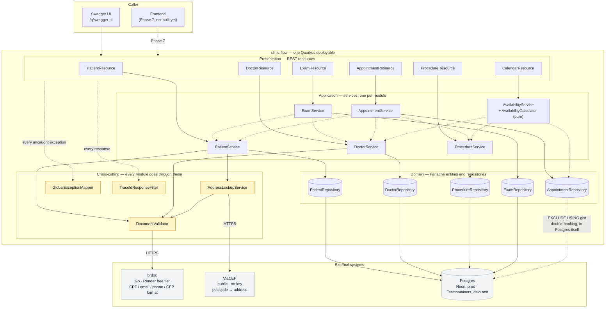

# clinic-flow

A clinic management system — patients, doctors, procedures, exams,
appointments, billing and calendar, one place — built to run a **public
sandbox**: anyone can register and try the real flow, not a screenshot of it.

Java 25, Quarkus 3.39. Backend for a portfolio project; the frontend (GSAP,
animejs, PT/EN/ES) is a separate app consuming this API.

## Status

**Phase 3 — calendar, tracing, virtual threads.** Everything through
appointments (patients, doctors, procedures, exams, double-booking rejected
by Postgres itself) plus the query side scheduling did not need but a
calendar view does: `GET /v1/doctors/{id}/availability` lists a doctor's free
slots for a day and a procedure. Every request carries an OpenTelemetry
trace id through its logs and back as `X-Trace-Id`; every endpoint runs on a
virtual thread rather than one of Quarkus's few event-loop threads.

## Architecture

One deployable, not a service mesh — see
[ADR-0001](docs/adr/0001-modulith-not-microservices.md) for why, given this
has to run on a Render free instance for a demo nobody scheduled in advance.
Modules are packages with real boundaries (`patient`, and whichever of the
roadmap below lands next), not layers spanning the whole domain.

Document validation — CPF, email, phone, postcode format — is not
reimplemented here. `clinic-flow` calls the already-deployed `brdoc` service
over HTTP; see [ADR-0002](docs/adr/0002-brdoc-over-http-not-reimplemented.md).
Postcode *content* (street, city, state) comes from ViaCEP, Brazil's public
postcode lookup, and is never allowed to block registration if it is slow or
down — see `AddressLookupService`.

Rendered as a diagram rather than described in prose, because the shape —
one REST layer, one service layer per module, one place every module reaches
the outside world through — is the point ADR-0001 and ADR-0002 argue for.
[Mermaid](https://mermaid.js.org/) renders this natively wherever this file
is viewed on GitHub — no draw.io account, no exported image to keep in sync
by hand, no dead link when the diagram changes; the diagram *is* the text
below it.



Solid arrows are calls made on every request through that path; dashed
arrows are either a module reusing another module's *service* (never its
entity or repository directly — that boundary is what keeps this a modulith
and not a shared-table free-for-all) or a guarantee that lives in Postgres
itself rather than in a call at all.

```
patient/             entity, repository, service, REST resource, DTOs
doctor/               same shape as patient/, plus a licence number
procedure/            the bookable catalogue — no brdoc involvement, no documents
exam/                 requested against a patient by a doctor, result recorded later
appointment/          patient + doctor + procedure + time slot; the double-booking
                      guarantee lives in the database, not here — see V5's migration
calendar/             the query side of scheduling — AvailabilityCalculator is pure,
                      unit-tested logic; AvailabilityService is where it meets the
                      database and the working-hours config
address/              the embeddable Address value object + the ViaCEP lookup
validation/brdoc/     the brdoc REST client and the DocumentValidator every
                      module validates through
validation/viacep/    the ViaCEP REST client
common/               the one exception mapper every module's errors go through,
                      the CPF-masking helper, and the trace-id response filter
```

## Concurrency and observability

Every resource method runs `@RunOnVirtualThread`: the code is ordinary
blocking Java — JPA, a blocking REST client call to brdoc — and a virtual
thread is what lets that scale like non-blocking code without becoming
non-blocking code. No manual thread-pool tuning, no reactive rewrite of
Hibernate ORM into Hibernate Reactive, no `Uni`/`Multi` chains threaded
through every method signature — the throughput case a reactive stack exists
to make is already made, at a fraction of the complexity.

Every request generates an OpenTelemetry trace id, which reaches every log
line that request produces (`quarkus.log.console.format` in
application.properties) and comes back to the caller as `X-Trace-Id`
(`TraceIdResponseFilter`). One identifier ties a request, its response and
every log line it wrote together — a caller reporting a problem can hand back
that one value. No collector is deployed yet (`quarkus.otel.traces.exporter=none`),
so nothing is exported anywhere; the ids exist and reach the logs regardless.

### Error handling

Every error this API returns — however it happened — comes back through
`GlobalExceptionMapper`, in one shape:

```json
{
  "field": "cpf",
  "message": "Invalid CPF format",
  "category": "VALIDATION",
  "traceId": "9be69c71af1b5854bdb8139bae338f26",
  "timestamp": "2026-09-04T18:51:37.303203Z",
  "path": "/v1/patients"
}
```

`category` is what makes the logs answerable at a glance — the question
"is this a bug, or someone sent bad data" without reading a stack trace:

| Category | Means | Example |
|---|---|---|
| `VALIDATION` | Well-formed request, a value fails a rule brdoc or this API owns | An invalid CPF |
| `CONFLICT` | Valid on its own, conflicts with state that already exists | A duplicate CPF, a double-booked doctor |
| `NOT_FOUND` | A referenced id does not exist | An unknown patient id |
| `SYSTEM` | Unexpected — everything else | brdoc timed out |

Every rejection is also logged at the point `GlobalExceptionMapper` decides
it — status, exception type, the caller's IP (from `X-Forwarded-For`, best-
effort until a trusted-proxy config like brdoc's `TRUSTED_PLATFORM` is added
here too) and the path — tagged with the same trace id as the response, via
`quarkus.log.console.format`. A `SYSTEM` error additionally logs the full
exception. Never logged, in any category: the value that was rejected — a
CPF is still personal data even when invalid, and this service is reachable
from a public sandbox.

## Roadmap

Each phase is a real, working increase in scope — not scaffolding for its own
sake. In the order they will be built:

1. ~~**Patients & doctors**~~ — done.
2. ~~**Clinical operations**~~ — done: procedures, exams, appointments, the
   double-booking guarantee.
3. ~~**Calendar**~~ — done: `GET /v1/doctors/{id}/availability?date=...&procedureId=...`.
4. **Billing** — Stripe and Mercado Pago/Pix, in sandbox mode only. Payment
   intents tied to an appointment, webhook handling, idempotent by design —
   a retried webhook must not charge twice.
5. **Public sandbox mode** — pre-seeded demo accounts so a first-time visitor
   has something to look at immediately, rate limiting on public
   self-registration (reusing the lesson from brdoc's own rate limiter), and
   a way to tell demo data apart from anything that matters.
6. **Observability** — structured JSON logs in production
   (`quarkus-logging-json`), request tracing, metrics beyond the Prometheus
   endpoint already wired up, health checks that actually check the
   dependencies (database, brdoc, payment provider) rather than just
   answering 200.
7. **Frontend** — Next.js, GSAP, animejs, i18n in PT/EN/ES, calling this API.
   Deployed separately (Vercel), same split as the validator's own playground.

## Running locally

Needs Java 25 and Docker — [Quarkus Dev Services](https://quarkus.io/guides/dev-services)
starts a real Postgres in a container automatically; there is no
docker-compose file to keep in sync with the schema by hand.

```bash
./mvnw quarkus:dev
```

Swagger UI: http://localhost:8080/q/swagger-ui
Health: http://localhost:8080/q/health

## Testing

Two kinds, kept apart by Maven's own naming convention rather than by hand:

- **Unit tests** (`*Test.java`, run by Surefire) — no Quarkus context, no
  database, no network. `AvailabilityCalculatorTest` is the one so far: pure
  free-slot math in, assertions out, fast enough to run on every save.
- **Integration tests** (`*IT.java`, run by Failsafe) — `@QuarkusTest`
  classes that boot the whole application against a real Postgres, started
  on demand by Dev Services. `brdoc` and ViaCEP are mocked (`@InjectMock`)
  even here — a test run should never depend on a third-party free service
  being awake, and brdoc's own contract is already covered by its own test
  suite. What these own is the wiring: a rejection from brdoc is handled
  correctly, a patient is stored with the *normalized* document values, a
  ViaCEP outage never blocks registration, a doctor is never double-booked.

```bash
./mvnw test      # unit only — seconds, no Docker
./mvnw verify    # unit + integration — what CI runs
```

## Deployment

**Backend:** Render, same free tier as `brdoc`, from [`render.yaml`](render.yaml)
— a [Blueprint](https://render.com/docs/blueprint-spec): point Render's
dashboard at this repo (New → Blueprint) and it creates the service from that
file. `Dockerfile` is a real multi-stage build — Maven runs *inside* it, so
Render's own `docker build` against a clean checkout is enough; see the notes
in `Dockerfile` and `AGENTS.md` for two build-environment bugs that cost real
time to track down (a `.dockerignore` excluding the source it needed to
build from, and a misleading Maven Wrapper checksum failure actually caused
by a missing `unzip`).

- **Database:** Neon Postgres. One environment variable, `DATABASE_URL` —
  Neon's own connection string, `postgresql://` swapped for
  `jdbc:postgresql://`. Credentials and `sslmode=require` already live inside
  it; nothing here reconstructs or appends to it.
- **brdoc:** `BRDOC_API_URL`, defaulted in `render.yaml` to the already-
  deployed instance — nothing to configure for a fresh deploy.
- **Payments:** Stripe and Mercado Pago in sandbox/test mode only, added when
  the billing phase starts — no key for either exists yet.

## License

[MIT](LICENSE).
